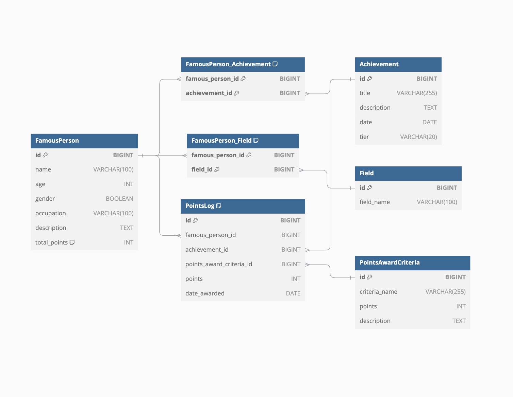

# spring-study

# 🔥본격🔥  최애 배틀 ⚔️

 제가 만든 서비스는 유명인의 업적을 수치화 시켜 랭킹으로 보여주는 서비스입니다.
당신의 그 잘난 유명인의 업적을 세상에 알리고 포인트를 쌓아 순위권 안에 유지시켜주세요. 😰

Service I made is a service that quantify the achievements of celebrities and shows them as a ranking.
Let the world know the achievements of your great celebrity, build points, and keep them in the ranking.


# 📚 목차
1. [소개](#소개)
2. [주요기능](#주요기능)
3. [테이블 설명](#테이블-설명)
    - [FamousPerson](#famousperson)
    - [Field](#field)
    - [FamousPerson_Field](#famousperson_field)
    - [Achievement](#achievement)
    - [FamousPerson_Achievement](#famousperson_achievement)
    - [PointsAwardCriteria](#pointsawardcriteria)
    - [PointsLog](#Pointslog)


## 🖼️ 소개 

이 mini  프로젝트는 유명인의 다양한 업적을 체계적으로 관리하고, 업적에 따라 포인트를 부여하며, 이를 통해 유명인의 랭킹을 산출하는 것을 목표로 합니다. 스키마(?) 통해 유명인과 그들의 업적, 분야, 포인트 부여 내역 등을 효율적으로 저장하고 관리할 수 있으며, 그들의 팬들에게 자긍심을 줍니다.


## 💡 주요기능

### - 유명인의 개인 정보와 그들이 속한 분야 관리

### -  업적 및 업적에 대한 상세 정보 저장

### -  포인트 수여 기준 정의 및 포인트 부여 내역 기록

### -  포인트 부여 시 총 포인트 자동 계산 및 업데이트

### -  유명인의 총 포인트를 기반으로 랭킹 산출



## 👨‍🏫 테이블 설명

### 1. FamousPerson
유명인의 기본 정보와 total point를 저장합니다.

```sql
CREATE TABLE FamousPerson (
   id BIGINT AUTO_INCREMENT PRIMARY KEY,  -- 고유 ID
   name VARCHAR(100),                     -- 이름
   age INT,                               -- 나이
   gender BOOLEAN,                        -- 성별 (0: 여자, 1: 남자)
   occupation VARCHAR(100),               -- 직업 또는 주요 활동
   description TEXT,                      -- 간략한 설명
   total_points INT DEFAULT 0             -- 총 포인트 (초기값 0)
);
```

### 2. Field
유명인이 활동하는 분야를 저장합니다.
```sql
CREATE TABLE Field (
   id BIGINT AUTO_INCREMENT PRIMARY KEY,  -- 고유 ID
   field_name VARCHAR(100)                -- 분야 이름
);
```

### 3. FamousPerson_Field
유명인과 분야 간의 n:m 관계를 나타냅니다.
```sql
CREATE TABLE FamousPerson_Field (
   famous_person_id BIGINT,               -- 유명인사 ID
   field_id BIGINT,                       -- 분야 ID
   PRIMARY KEY (famous_person_id, field_id),
   FOREIGN KEY (famous_person_id) REFERENCES FamousPerson(id),
   FOREIGN KEY (field_id) REFERENCES Field(id)
);
```

### 4. Achievement
유명인의 업적 정보를 저장합니다.
```sql
CREATE TABLE Achievement (
   id BIGINT AUTO_INCREMENT PRIMARY KEY,  -- 고유 ID
   title VARCHAR(255),                    -- 업적 제목
   description TEXT,                      -- 업적 설명
   date DATE,                             -- 업적 달성 날짜
   tier VARCHAR(20)                       -- 업적 티어 (예: 도시지배급, 국가권력급)
);
```
### 5. FamousPerson_Achievement
유명인과 업적 간의 n:m 관계를 나타냅니다.
```sql
CREATE TABLE FamousPerson_Achievement (
   famous_person_id BIGINT,               -- 유명인사 ID
   achievement_id BIGINT,                 -- 업적 ID
   PRIMARY KEY (famous_person_id, achievement_id),
   FOREIGN KEY (famous_person_id) REFERENCES FamousPerson(id),
   FOREIGN KEY (achievement_id) REFERENCES Achievement(id)
);
```

### 6. PointsAwardCriteria
포인트를 부여하는 기준과 해당 포인트 값을 정의합니다.
```sql
CREATE TABLE PointsAwardCriteria (
   id BIGINT AUTO_INCREMENT PRIMARY KEY,  -- 고유 ID
   criteria_name VARCHAR(255),            -- 기준 이름
   points INT,                            -- 부여될 포인트
   description TEXT                       -- 기준 설명
);
```

### 7. PointsLog 
포인트를 부여하는 기준과 해당 포인트 값을 정의합니다.
```sql
CREATE TABLE PointsLog (
   id BIGINT AUTO_INCREMENT PRIMARY KEY,  -- 고유 ID
   famous_person_id BIGINT,               -- 유명인사 ID
   achievement_id BIGINT,                 -- 업적 ID
   points_award_criteria_id BIGINT,       -- 포인트 수여 기준 ID
   points INT,                            -- 부여된 포인트
   date_awarded DATE,                     -- 포인트 부여 날짜
   FOREIGN KEY (famous_person_id) REFERENCES FamousPerson(id),
   FOREIGN KEY (achievement_id) REFERENCES Achievement(id),
   FOREIGN KEY (points_award_criteria_id) REFERENCES PointsAwardCriteria(id),
   UNIQUE KEY unique_points_award (famous_person_id, achievement_id, points_award_criteria_id)
);
```


## 💭 만들면서 고려했던 부분

1. 포인트 로그 테이블에서 동일인물 동일업적 동일조건에 조합으로 **중복 수혜를 막고자 유니크 키를 사용하였음**
2. PointsLog 테이블이 포인트를 직접 저장하지 않고, PointsAwardCriteria의 points를 참조하면서 미래에 포인트 값이 변경된다면 과거에 부여된 포인트에도 영향을 주게 됨
   **로그 테이블에서 포인트 부여시점의 점수를 직접 저장하게 포인트 칼럼을 추가함**
3. 랭킹을 계산할 때마다 PointsLog 테이블에서 실시간으로 총점을 합산하면
   추후에 데이터가 많아질경우  성능 저하가 발생할 수 있는데..
   이건 트리거를 사용해서 **total_points를 즉시 업데이트하면 될거 같다**

## 💰나중에 진짜 서비스로 만들어보고싶다.

입니다!!
